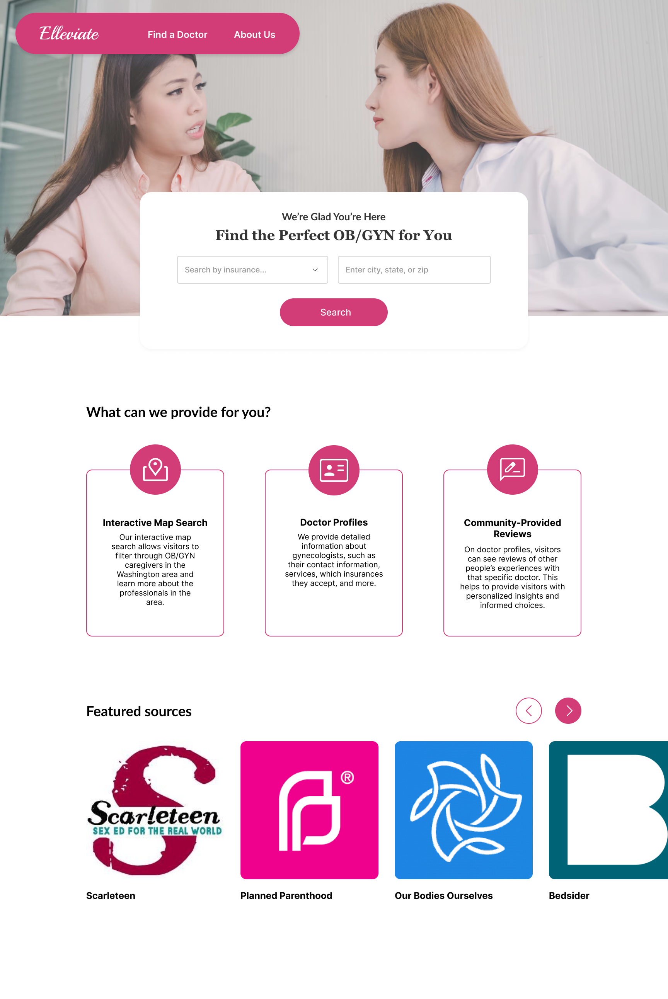
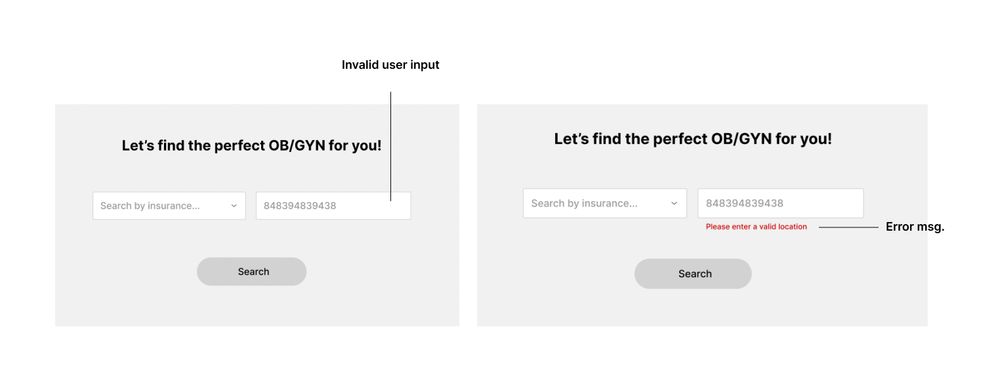
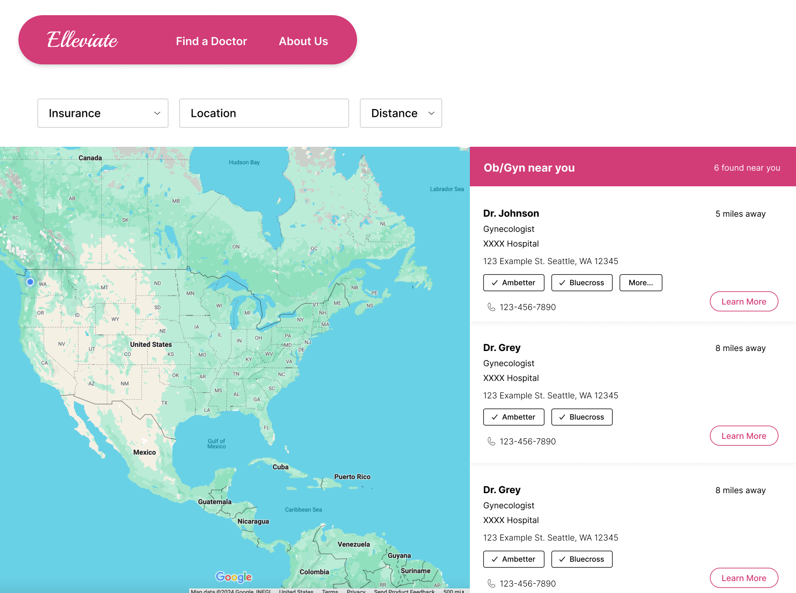
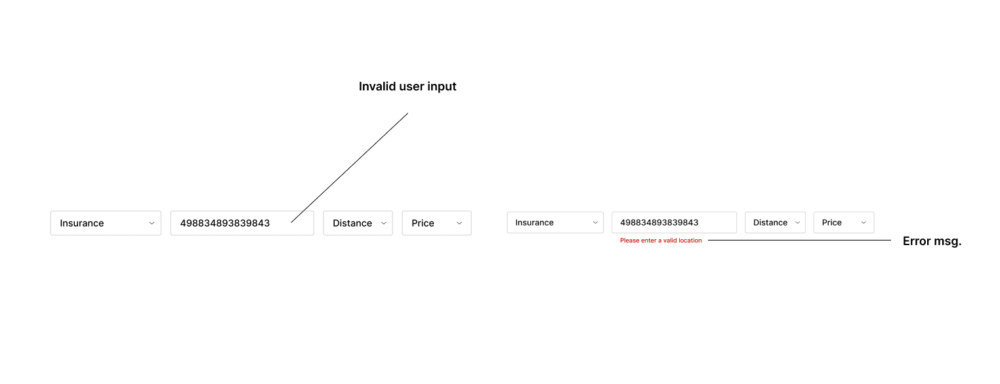
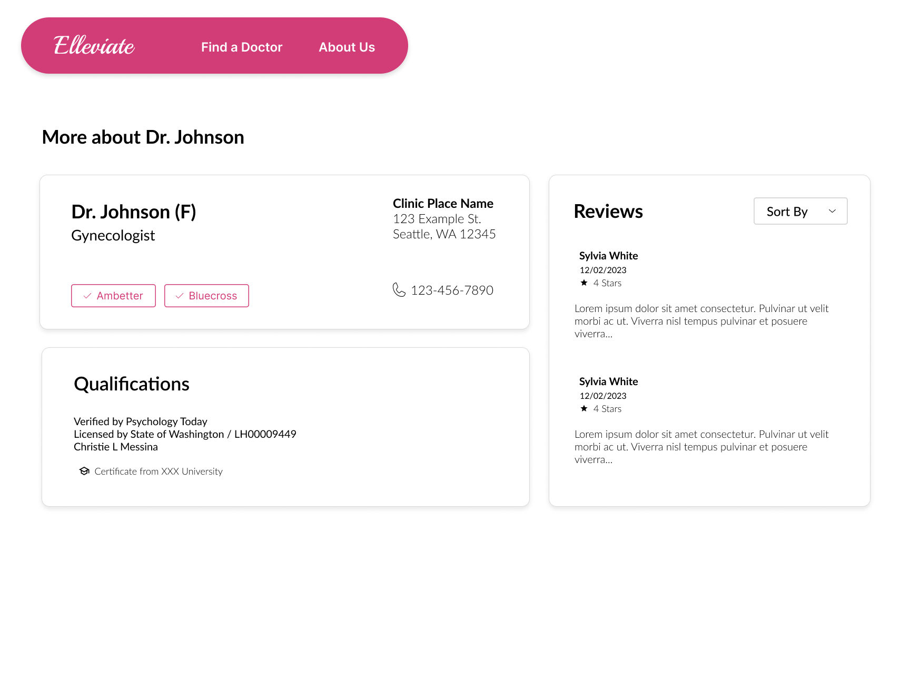
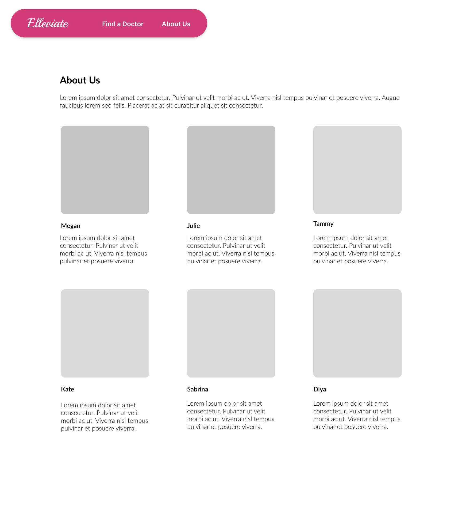
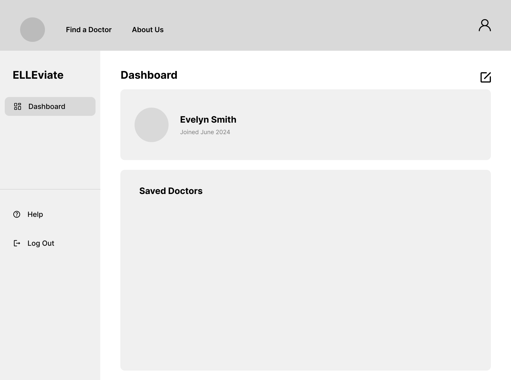
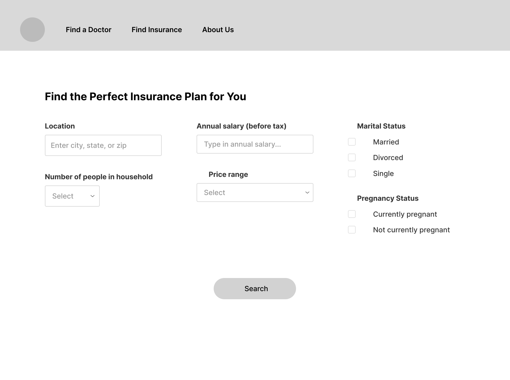
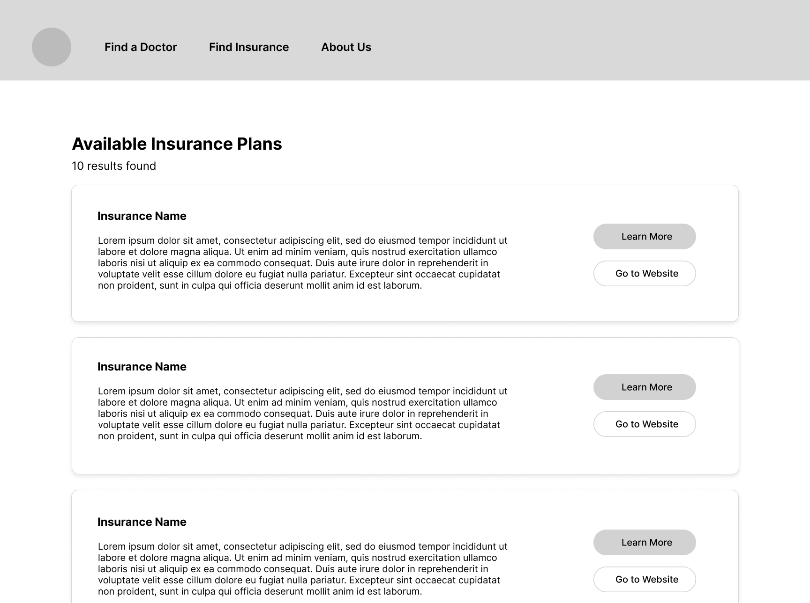

# Problem Statement

Low-income women in the United States face disproportionate barriers to accessing healthcare. Gender economic inequality means women are less likely to have insurance, compromising their ability to pay for treatments and services. According to the National Library of Medicine, many women pay out-of-pocket for critical preventative screening examinations such as pap smears, mammograms, and colonoscopies (Cardoso et al., 2021). A 2022 survey on how the COVID-19 pandemic has impacted access to health care revealed that one in four women have experienced a disruption to healthcare access and 16% of women have experienced disruptions to gynecologic care access (Turner et al., 2022). Furthermore, cancer survivors have a higher probability of delayed access (RAD-AID International, n.d.).

These factors drive up the mortality rate for women because they are at higher risk of dying from preventable conditions such as pregnancy complications, disease, and chronic illnesses. Children of women who have been denied treatment are also at higher risk for developmental disorders, malnutrition and chronic illnesses, and the likelihood of death in infancy increases. Children in poor health are more susceptible to lower educational opportunities, and treating chronic illness raises the cost of childcare for mothers, causing even more financial strain on women already facing difficulties accessing health care for themselves (Zephyrin et al., 2020).

One existing solution is the Affordable Care Act, which creates more affordable health insurance and programs like RAD-AID to cover services like breast and cervical cancer screenings as well as radiology. While this policy mandates that preventative care services be included in insurance, its programs are limited in scope to specific locations, and women must meet specific criteria to access them. Women of color, transgender women, and other marginalized groups are disproportionately harmed by these limitations because it is more difficult for them to meet the program criteria as well as live in areas where programs are active (Cardoso et al, 2021). Therefore, comprehensively addressing these shortcomings will significantly improve the health of low-income women and future generations.

### Citations
 
Cardoso, L. J., Gassman-Pines, A., & Boucher, N. A. (2021, May). Insurance barriers, gendering, and access: Interviews with Central North Carolinian women about their health care experiences. The Permanente journal. https://www.ncbi.nlm.nih.gov/pmc/articles/PMC8784032/#:~:text=Women%20face%20unique%20obstacles%20when,average%20earn%20less%20than%20men.

Rad-aid USA Women’s Health Access Initiative. RADAID International RSS. (n.d.). https://rad-aid.org/programs/rad-aid-usa-womens-health-access-initiative/?gad_source=1&gclid=Cj0KCQjwj9-zBhDyARIsAERjds29n8PFHog55NFYOT5dKCr9UrJZng_DcZqkzL37TXRG4cvYgrXPf4IaAnNBEALw_wcB

Transforming Primary Health Care for women - part 1: A framework for addressing gaps and barriers. Transforming Primary Health Care for Women, Part 1: A Framework | Commonwealth Fund. (2020, July 16). https://commonwealthfund.org/publications/fund-reports/2020/jul/transforming-primary-health-care-women-part-1-framework

Turner, K., Brownstein, N. C., Whiting, J., Arevalo, M., Islam, J. Y., Vadaparampil, S. T., Meade, C. D., Gwede, C. K., Kasting, M. L., Head, K. J., & Christy, S. M. (2022, December). Impact of the COVID-19 pandemic on Women’s 
Health Care Access: A cross-sectional study. Journal of women’s health (2002). https://www.ncbi.nlm.nih.gov/pmc/articles/PMC9805885/#:~:text=One%20in%20four%20women%2028.5,to%20women%20identifying%20as%20heterosexual.

# Solution Summary

Our solution addresses the challenges of inadequate access to healthcare faced by women in Washington State by creating a website that helps women find more accessible and personalized gynecology care and services in their area. This website will provide comprehensive information tailored to individual needs, including available care options based on their insurance, price range, location, and other factors. They will additionally be able to view detailed profiles of gynecological doctors through their qualifications, services offered, and patient reviews. This approach aims to bridge the gap created by logistical and financial barriers, ensuring that women, especially those from marginalized groups, can improve their health outcomes and reduce long-term impact on future generations through accessible services.

# Design

Every page consists of:

* Navigation bar
* Body
* Footer (Stretch)

## Colors
- Primary color: #d23c77
- Secondary color: #eo7aa2
- Tertiary color: #fdfdfd

## Navigation Bar

Figure 1: Navigation bar

Each page on the website will consist of a navigation bar. The navigation bar will consist of the website logo on the left that directs the user to the homepage, along with two links to “Find a Doctor” (that directs users to 2.2 Interactive Map) and an "About Us" (3.0).

**Stretch Goal:** A footer will be included at the bottom of the screen that displays the copyright information of our website

**Stretch Goal 2:** In the case that we are able to add a user authentication, a set of log-in and sign-up buttons will be available on the right side depending on the state of the log-in.

## Homepage

Figure 2: Homepage consisting of the navigation bar, search tool, infographics, and featured resources.

### 1.1 Search Tool
When users arrive on our homepage, they will immediately see our primary feature: a search tool that allows them to find an OB/GYN based on their insurance plan and location/address (e.g., state, city, or zip code). While the user can add in their location/address manually, they will be prompted to choose from a list of provided insurances that matches theirs. 

Once the user presses the ‘Search’ button, they will be directed to the interactive map page to adjust various filters and search through a list of OB/GYN based on their input. 

**Stretch Goal:** When searching location, an expanded box underneath will show autofilled suggestions for the user to click on.

### 1.2 About Infographic
Just below this tool, there's a non-interactive infographic explaining our goals, purpose, and services in three horizontal card formats. These would not be exandpable and will remain static.

### 1.3 Featured Resources
Resources will be available to users in the form of horizontal card formats. This will include links to external sources and organizations specializing in providing information about specific gynecological care such as Planned Parenthood or Scarleteen. Users will be able to click on either the linked name or image icon to open the organization's website on a new tab.

### Error State
If a user provides an invalid address, the user will be prompted an error message that states ‘Please enter a valid location’ in red font.

Figure 3: Error state for invalid address.

## Find A Doctor

Figure 4: Interactive map with filters and doctor listings.

### 2.1 Filters
On our interactive map page, the user will be shown a horizontal array of filters that include insurance plan(s), location/address, distance, and price. The insurance plan(s), distance are drop down filters, which means that the user only has a set of inputs they can choose from. The price filter has a unique function: when the user clicks on the filter, it allows the user to input a price range for individual OB/GYN appointments. 

### 2.2 Interactive Map
Below the filters, there is an interactive map on the left side of the screen in which users can scroll through their chosen location to look at available OB/GYN professionals based on their filter inputs. When there are no filters applied to the map, the default view would be the entire map of the United States. Each pinpoint on the map represents all of the professionals available.

### 2.3 List of Doctors
On the right side of the screen, the user will be provided with a scrollable list of professionals with various details about them such as their name, profession, phone number, address, which insurance plans they accept, and how far they are from the specified location. If the user wishes to learn more about a specific professional, they can click on the ‘Learn More’ button and the user will be directed to a separate page with additional details about that professional.

### Error State
If a user provides an invalid address, the user will be prompted an error message that states ‘Please enter a valid location’ in red font.

Figure 5: Error with invalid address.

## Doctor's Profile

Figure 6: Individual doctor profile with basic information, qualifications, and reviews.

The user will be directed to a separate page showing the doctor’s profile if they click on the ‘View More’ button on the interactive map page next to the details of a specific professional.

On the profile page, the user can view details such as the doctor’s basic information (e.g., name, profession, location, phone number, which insurance they accept), as well as their qualifications, services provided, financial information, and user-provided reviews (from Yelp and Google). 

### 3.1 Patient Reviews
The user can scroll through the list of reviews and choose to filter the reviews with the ‘Sort By’ filter, which has the options to sort by the lowest ratings, highest ratings, most recent, and oldest reviews. Once a user chooses a filter from the dropdown, the reviews will automatically refresh to match the filter applied.

### Error State
No error states occur on this page.

## About Us

Figure 6: About Us page with team information.

The ‘About Us’ page is available for users to view a short introductory statement and the team behind ELLEviate, along with additional information about them. Each member's information is displayed in a card format and is non-interactive.

### Error State
No error states occur on this page.

## User Data/Authentication (STRETCH GOAL)

Figure 7: User dashboard

User authentication will allow the creation of accounts on the website. This enables the ability to save information for easier search on the interactive map, along with saving specific doctors that they would like to be in contact with.

### 4.1 Edit Profile
Users are able to edit their profile such as name, insurance type, location, and upload a profile picture if they desire.

### 4.2 Bookmarked Doctors
Beneath the basic information, the user will be able to view a list of gynecological doctors that they bookmarked. The information listed will share the same format as 2.3 List of Doctors. Users will be able to remove doctors that they do not want in their Bookmarked Doctors anymore through an editing icon in this section.

### Error State
No error states occur on this page.

## Insurance Plan Finder Tool (STRETCH GOAL)

Users would be able to search for appropriate insurance plans that would especially cover gynecological care treatment and costs.

### 5.1 User Information Page

Figure 8: User input for finding suitable insurance plans

Users will be required to enter the following information in the respective text fields:
- Sex assigned at birth
- Age
-  Zip Code
 - Number of people in their household
- Estimated yearly salary before tax
- Uses tobacco or not
- Is pregnant or not

If a user wants to add a spouse or a dependant, an additional section will appear. When the user clicks the "View Plans" button after filling in all of the require fields, the user will be directed to the "Insurance Plan Results Page".

### Error State

If the user does not enter any of the required information when attempting to submit, an error message will appear.

### 5.2 Insurance Plan Results Page

Figure 9: Results of suitable insurance plans

The results will be based on the information the user provides in the "User Information" page

Each insurance plan will display information such as:
 - Name of insurance
 - Brief description
 - Estimated average monthly premium
 - Available link to their website
 - Etc.

 ### Error State
No error states occur on this page.

### 5.3 Insurance Plan Details

The insurance plan details page will display information that it covers for various applicable services.

 ### Error State
No error states occur on this page.
